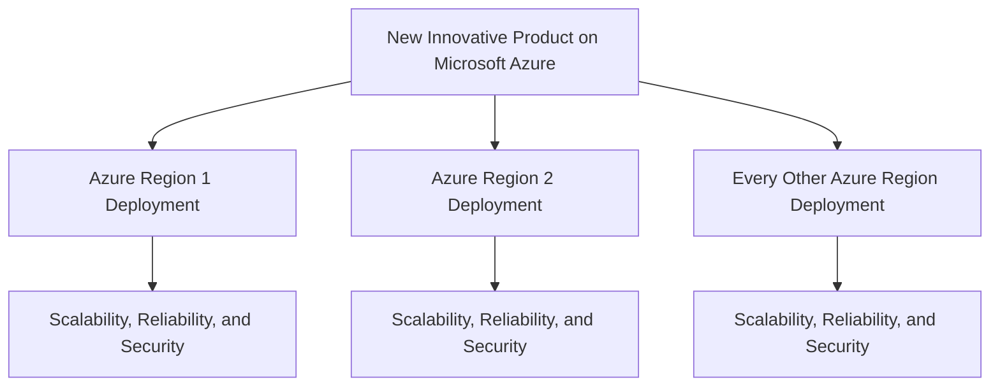

Fart Corp

# New Innovative Product

## Overview

New Innovative Product is intended to deliver a groundbreaking, global solution on Microsoft Azure. Its stated goal is to be available in every Azure region while maintaining scalability, reliability, and security across all deployments.

The source does not identify specific product capabilities, users, stakeholders, service-level targets, regulatory requirements, or data-handling needs. These remain open questions and should be defined before detailed design begins.

## Architecture

The supported architecture is a globally distributed product deployed on Microsoft Azure in every region. Each regional deployment must satisfy the project's scalability, reliability, and security goals. The source does not specify application components, Azure services, data stores, networking, regional coordination, or request-routing behavior.

Open architecture questions include which Azure services will host the product, how deployments will be routed and coordinated, whether data is regional or globally replicated, and how availability and security will be measured.

## Implementation

- Implement and validate a Microsoft Azure deployment for every target region.
- Define measurable scalability, reliability, and security requirements before selecting Azure services or deployment patterns.
- Establish a repeatable deployment approach so regional deployments can be configured and maintained consistently.
- Validate each regional deployment against the agreed scalability, reliability, and security requirements.
- Resolve the unspecified product capabilities, users, data model, networking, observability, recovery objectives, and compliance requirements before finalizing the implementation design.
