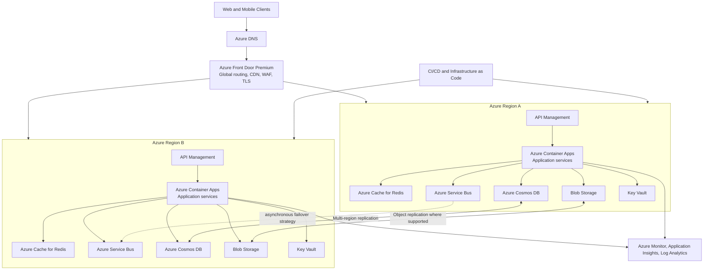

# New Innovative Product — Architecture Document

## 1. Executive Summary

Fart Corp will build the New Innovative Product as a globally available, cloud-native platform on Microsoft Azure. The architecture prioritizes regional availability, horizontal scalability, security, operational consistency, and controlled expansion into every Azure region that supports the required services.

Because the source brief does not define product-specific user journeys, data types, protocols, traffic volumes, or regulatory obligations, this document establishes a reusable reference architecture. Product-specific services can be added behind the API layer without changing the global delivery, security, deployment, or observability model.

## 2. Goals and Quality Attributes

### Goals

- Provide a consistent product experience to users worldwide.
- Minimize user latency by routing requests to healthy nearby regions.
- Continue serving traffic after a regional failure.
- Scale automatically as demand changes.
- Protect identities, application traffic, secrets, and stored data.
- Deploy and operate all regions through repeatable automation.

### Initial service objectives

| Attribute | Initial target |
|---|---|
| Availability | 99.99% for the public service, measured monthly |
| Recovery time objective (RTO) | 15 minutes for a regional outage |
| Recovery point objective (RPO) | 5 minutes for transactional data |
| Performance | p95 API latency under 500 ms, excluding client network latency |
| Deployment | No planned downtime for routine releases |
| Security | Encryption in transit and at rest; least-privilege access; centralized audit logs |

Targets must be validated against business impact, data-consistency needs, service availability by region, and budget before production launch.

## 3. Scope and Assumptions

### In scope

- Global traffic ingress and routing
- Regional application compute and APIs
- Transactional data, object storage, caching, and messaging
- Identity, secrets, network controls, and threat protection
- Observability, disaster recovery, and automated delivery

### Assumptions

- The product exposes web and/or mobile clients that call HTTPS APIs.
- The workload is stateless at the compute tier; durable state is held in managed data services.
- The product can tolerate eventual consistency across regions for most data.
- A small set of paired regions will launch first, followed by controlled regional expansion.
- “Every region” means every approved Azure region in which all mandatory dependencies, compliance controls, and operational support are available. Regions lacking a required service use the nearest compliant serving region.

## 4. Architecture Overview

Azure Front Door is the single global entry point. It terminates TLS, applies web application firewall rules, accelerates static content, probes regional endpoints, and routes traffic to the nearest healthy deployment. Each region contains an independently deployable application stack. Regional isolation limits the blast radius of failures and allows regions to scale separately.

## 5. Component Design

### Global edge

- **Azure DNS** hosts public DNS records.
- **Azure Front Door Premium** provides anycast ingress, health-based routing, TLS termination, caching, bot protection, and WAF policies.
- Origin access is restricted so clients cannot bypass Front Door. Private Link origins should be used where supported.

### API and application tier

- **Azure API Management** provides API versioning, authentication enforcement, quotas, rate limiting, request validation, and developer-facing API governance.
- **Azure Container Apps** hosts stateless application services and background workers. It provides managed revisions, autoscaling, and workload isolation without the operational overhead of a full Kubernetes platform.
- Each API request carries a correlation ID. Services expose readiness and liveness endpoints and use bounded timeouts, retries with jitter, and circuit breakers.
- Long-running or failure-prone tasks are moved from synchronous requests to queues.

If the product later requires specialized networking, GPUs, or fine-grained Kubernetes control, the compute tier can move to Azure Kubernetes Service while preserving the edge and data contracts.

### Data tier

- **Azure Cosmos DB** is the default transactional store because it supports global distribution. Partition keys must spread load evenly and align with primary query patterns.
- Writes use a designated write region initially. Multi-region writes may be enabled only after conflict-resolution behavior is defined and tested.
- **Azure Blob Storage** stores documents, media, exports, and backups. Lifecycle policies move aging objects to lower-cost tiers.
- **Azure Cache for Redis** holds disposable cached data, sessions when unavoidable, and rate-limit counters. The application remains correct after cache loss.
- **Azure Service Bus** decouples services and workers. Consumers are idempotent; poison messages move to dead-letter queues with alerts.

Data residency requirements may require separate regional data stamps rather than global replication. Tenant-to-stamp placement and allowed replication boundaries must be captured in a data classification policy.

## 6. Regional Topology and Availability

The platform uses active-active application deployments in at least two Azure regions. Front Door sends traffic only to healthy regional origins. Each regional stack is self-contained and can serve requests without a dependency on another region, except for explicitly replicated managed data services.

Within each region:

- Use availability zones for supported services and production tiers.
- Maintain independent scaling rules and capacity headroom.
- Avoid synchronous cross-region calls on the request path.
- Deploy resources into a virtual network with separate ingress, application, data, and private-endpoint subnets where applicable.
- Use private endpoints and private DNS for data services and Key Vault.

Regional rollout proceeds in waves: canary region, initial paired regions, then additional geographies. A region is admitted to global routing only after automated functional, security, latency, capacity, and failover checks pass.

## 7. Security Architecture

### Identity and access

- Microsoft Entra ID authenticates workforce users and workload identities.
- Customer identity uses Microsoft Entra External ID or another approved OpenID Connect provider.
- Managed identities replace stored service credentials wherever Azure services support them.
- Azure role-based access control grants least privilege through groups; production access is time-bound and audited through Privileged Identity Management.

### Data and secrets

- TLS 1.2 or later protects all network traffic.
- Azure-managed encryption protects data at rest; customer-managed keys are introduced where contractual or regulatory requirements demand them.
- Azure Key Vault stores certificates, keys, and unavoidable secrets. Applications access it through managed identity.
- Sensitive data is classified, minimized, masked in non-production environments, and excluded from logs.

### Platform protection

- Front Door WAF uses managed and product-specific rules, initially in detection mode and then prevention mode after tuning.
- Microsoft Defender for Cloud monitors configuration and workload threats.
- Azure Policy enforces approved regions, encryption, diagnostic settings, tags, private networking, and secure transport.
- Container images are scanned, signed, stored in Azure Container Registry, and promoted by immutable digest.
- Centralized audit logs are retained according to policy and protected from application-level alteration.

## 8. Scalability and Performance

- Container Apps scales HTTP services on concurrent requests and workers on queue depth.
- Minimum replicas in production prevent cold-start latency; maximum replicas protect dependent services.
- Front Door caches safe static and public responses at the edge.
- Redis caches expensive, repeatable reads with explicit expiry and invalidation rules.
- Cosmos DB capacity uses autoscale initially. Partition hot spots, throttling, request-unit consumption, and query efficiency are monitored.
- Load tests establish per-region capacity, saturation points, and safe autoscaling thresholds before launch.

Capacity plans include ordinary peaks, loss of the largest active region, deployment overlap, and dependency quotas. Global routing weights must not send more traffic to a failover region than it can safely absorb.

## 9. Reliability and Disaster Recovery

### Failure handling

- Front Door health probes remove unhealthy origins automatically.
- Transient failures use limited exponential backoff with jitter; non-transient failures fail fast.
- Queue consumers are idempotent and use duplicate detection where suitable.
- Bulkheads and circuit breakers prevent one dependency from exhausting the full application.
- Feature flags allow risky functionality to be disabled without redeployment.

### Data recovery

- Enable continuous backup or point-in-time recovery for transactional stores.
- Use soft delete, versioning, and retention policies for Blob Storage and Key Vault.
- Maintain infrastructure definitions and deployment artifacts outside any single region.
- Test restore procedures quarterly and regional failover at least twice per year.

### Regional outage sequence

1. Monitoring detects regional endpoint failure.
2. Front Door stops routing new requests to the unhealthy region.
3. Traffic shifts to healthy regions within their tested reserve capacity.
4. Operators confirm data-service health and, if required, promote a write region using an approved runbook.
5. The failed region is rebuilt from infrastructure code, validated, and gradually returned to service.

## 10. Observability and Operations

- **Application Insights** collects distributed traces, request rates, latency, failures, and dependency telemetry.
- **Azure Monitor and Log Analytics** centralize platform metrics, logs, audit records, and dashboards.
- OpenTelemetry provides consistent instrumentation and propagates trace context across HTTP and messaging boundaries.
- Alerts focus on user impact and service objectives: availability, error rate, latency, queue age, throttling, saturation, and replication health.
- Synthetic tests execute critical user journeys from multiple geographies.
- Every alert links to an owned runbook; on-call escalation and incident communication are defined before production.

Telemetry includes region, deployment version, service, operation, and correlation identifiers. It excludes credentials and sensitive payloads. Sampling preserves errors and high-value transactions.

## 11. Delivery and Infrastructure

- Define Azure resources using Bicep or Terraform and keep environment configuration separate from reusable modules.
- Use separate subscriptions or strong equivalent boundaries for production and non-production.
- CI validates code, dependencies, containers, infrastructure templates, policy compliance, and automated tests.
- CD promotes immutable artifacts through development, staging, canary, and production.
- Regional releases use progressive traffic: deploy a new revision, run smoke tests, send a small traffic percentage, observe service-level indicators, then expand.
- Database changes follow an expand-and-contract pattern so old and new application versions can run concurrently.
- Rollback restores the prior application revision; data migrations require tested forward-fix and recovery procedures.

## 12. Cost Management

- Tag resources by product, environment, region, owner, and cost center.
- Set budgets and anomaly alerts at subscription and product levels.
- Scale non-production environments down outside working hours.
- Review Cosmos DB throughput, log ingestion, cache sizing, egress, and idle regional capacity monthly.
- Treat each new region as a deliberate capacity and compliance decision; global reach does not require identical capacity everywhere.

Reliability objectives and regional coverage drive significant fixed cost. The business must approve the tradeoff between active-active capacity, recovery targets, and the number of simultaneously active regions.

## 13. Key Risks and Mitigations

| Risk | Mitigation |
|---|---|
| Required Azure services are unavailable in a target region | Maintain an approved-region matrix and route unsupported locations to the nearest compliant region |
| A global configuration error affects every region | Use staged regional deployment, policy checks, independent rollback, and break-glass controls |
| Data residency conflicts with global replication | Classify data and use geography-specific data stamps with explicit replication policies |
| A regional failover overloads remaining regions | Reserve headroom, enforce routing weights, and run regular failover load tests |
| Cosmos DB partition hot spots or unexpected cost | Validate partition keys with representative load and monitor request units per partition |
| Edge or identity dependency becomes a global failure point | Use service-native resilience, cached authorization where safe, and documented degraded modes |
| Sparse product requirements lead to premature platform choices | Validate the architecture through product discovery and short technical spikes before committing |

## 14. Decisions Requiring Product Input

Before implementation, stakeholders must decide:

1. Primary user journeys, interfaces, and latency expectations.
2. Data model, consistency requirements, retention, residency, and deletion obligations.
3. Expected launch traffic, growth, geographic distribution, and peak patterns.
4. Regulatory, contractual, and industry security requirements.
5. Required availability, RTO, and RPO backed by business-impact analysis.
6. Tenant isolation model and customer identity requirements.
7. Approved regional rollout order and operating budget.

## 15. Implementation Roadmap

### Phase 1 — Discovery and foundation

- Resolve the open decisions above.
- Build a threat model, data classification, service objectives, and cost model.
- Establish identity, subscription hierarchy, policy, networking, logging, and infrastructure modules.

### Phase 2 — Minimum production architecture

- Deploy the edge, APIs, compute, data, messaging, and observability stack in two regions.
- Implement automated delivery, backups, restore tests, dashboards, alerts, and runbooks.
- Validate security, performance, regional failover, and recovery objectives.

### Phase 3 — Global expansion

- Add approved regional stamps in deployment waves.
- Tune routing, data placement, cache behavior, and capacity using real traffic.
- Conduct recurring resilience exercises, security reviews, and cost optimization.

## 16. Acceptance Criteria

The architecture is ready for production when:

- Two regions can independently serve all critical user journeys.
- Automated failover and recovery meet the approved RTO and RPO under load.
- Infrastructure and application releases are reproducible and progressively deployed.
- Security controls, threat-model mitigations, and compliance evidence are verified.
- Dashboards and actionable alerts cover every approved service objective.
- Backup restoration, regional evacuation, and rollback have been demonstrated through exercises.
- Product owners approve residual risks, cost, and the regional expansion plan.
