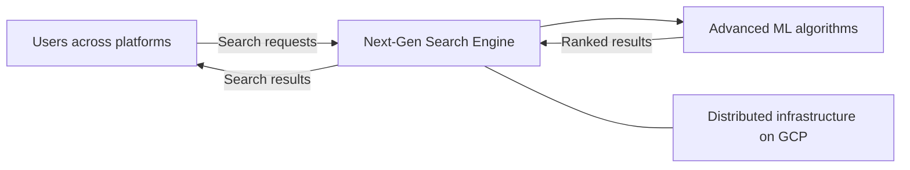

Google

# Next-Gen Search Engine

# Overview

The Next-Gen Search Engine project will provide faster, more accurate search results and improve the user experience across all platforms. Its scope includes advanced machine learning for search capabilities and distributed computing infrastructure on Google Cloud Platform (GCP) for scalability, reliability, and global availability. The primary stakeholders identified in the brief are search users across supported platforms.

# Architecture

The architecture combines a cross-platform search experience, machine-learning-driven search processing, and distributed infrastructure hosted on GCP. Users submit searches through supported platforms; the search engine applies advanced machine learning algorithms and returns results. GCP provides the globally available, scalable, and reliable infrastructure on which the search capabilities run.

# Implementation

- Implement the search capabilities using advanced machine learning algorithms, measuring improvements against the goals of faster and more accurate results.
- Run the system on distributed GCP infrastructure and validate scalability, reliability, and global availability.
- Ensure the search experience operates consistently across all supported platforms.
- Open questions: Which platforms are in scope, which GCP services will be used, what datasets and model approaches are approved, and how will speed, accuracy, reliability, and availability be measured?
